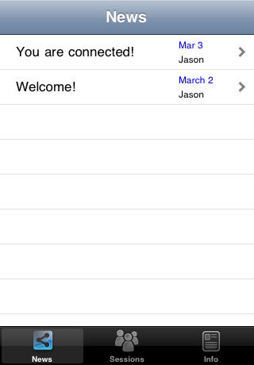
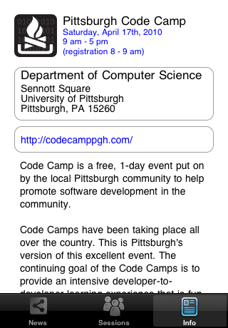

**Pittsburgh Code Camp 2010.1**
Thanks to everyone who attended my session at the [Pittsburgh Code Camp](http://codecamppgh.com/CodeCamp2010_1_info.aspx) on Apr 17.  I'll get the latest code, demo code and slides posted here and on the Code Camp web site as soon as I get a chance!  Thanks again!

**Project Description**
The Pittsburgh Code Camp iPhone Application is meant as a demonstration of the creation of an iPhone application while at the same time providing the attendees of the 2010.1 code camp a potentially useful application.

**How it works**
When the app starts, it will try and download an updated XML file from a pre-configured website.  The data will be loaded into the object model which will be used a a data source for the different screens.  The code camp director and volunteers can therefore update this XML data whenever they need in order to keep the application up-to-date. The data will be cached on the user's device to ensure they always have _something_ to look at even it is is stale data.

**App Store Release**
After much rejection, I finally have the Code camp app approved in the App Store!  Here is a link: [Available in the App Store](http://itunes.apple.com/us/app/pittsburgh-code-camp/id359789229?mt=8&ign-mpt=uo%3D6)

**Screenshots**
Here are the screenshots so far ... taken from the iPhone simulator...

